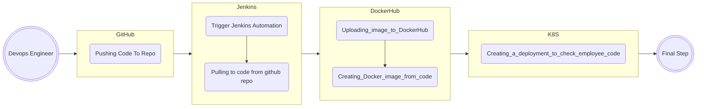

---

<h1> Hey Again &nbsp;&nbsp;&nbsp;Welcome To My "final_proj_git_jenkins" &nbsp;=)</h1>

 

## 💻 Languages and Tools:

   

---

&nbsp;
&nbsp;
&nbsp;
&nbsp;

<h2> ###   Instruction For Jenkins To Run New Job  ###&nbsp;</h1>
 
<h4>first step:</h4>
in jenkins go to:

Dashboard > Manage Jenkins > Plugin Manager

and install these plugins:

- GitHub, GitHub API Plugin, GitHub Branch Source, GitHub Pull Request Builder, Pipeline: GitHub Groovy Librarie.
- Docker, Docker API Plugin, Docker Commons Plugin, Docker Pipeline.
- Kubernetes, 'Kubernetes :: Pipeline :: DevOps Steps', Kubernetes CLI Plugin, Kubernetes Client API Plugin, Kubernetes Continuous Deploy Plugin, Kubernetes Credentials,Kubernetes Credentials Provider.

<h4>next step:</h4>
create docker hub and k8s credentials.

in jenkins:

Dashboard > Manage Jenkins > Credentials.

click on "global" and the on "add cred" as in the picture :

then you will see that, this is the type to create docker hub username and password:

insert all the fields, username and password that you connect with it to "DOCKERHUB"
then give id name like "dockerhub" and description.

<h4>next step:</h4>

in my Jenkinsfile i have the first lines:

change:
- IMAGE_NAME contnet to your user name and repo
- KUBECONFIG to the path of .kube in your master
- if you want to u can change also > CLUSTER_NAME, NAMESPACE as u wish, but need to change it in more places in the code.

<h4>next step:</h4>

run the pipeline, my example of pipeline it will build all even the cluster.

  to run need you will see in the main page in jenkins in left side "build with parameter"
  
  
  
  what thet it means actually is to run with specific branch, why is it good? cuz we dont want any time to run main branch, do you test in custom branch run the pipeline with the code of this costum branch and if all is good merge it into main and then run again and check.
  
  when you will click on "build with parameter" you will see:
  
  
  
  change to you branch name.

- first stage will connect to your branch in the repo
- next stage "Build Docker Image"
- next "Push Image" to your repo this stage will use your dockerhub cred that created prev
- next "Check and Create Kind Cluster" will check if cluster not already exists and create one
- next "Manual Approval" will wait to your approval, before approve do those steps:

    back to "Credentials" and click again on global, and now we will add one for k8s, and keep attention to the type
    (note!! if you dont see kubeconfig type as picture check again that you installed all the plugins above):
    
    
    - put id and description
    - in your k8s cluster go to master node
    - then nevigate to ~/.kube dir and copy your content of config file
    - paste the content in jenkins cred in the section "kubeconfig", click on the radio button "enter directly" and past it there.
    - then in you cluster create "namespace" called jenkins.
    - then approve the stage and continue
 
- next "Check Deployment" it will check if its exists
- next "Deploy to Kubernetes" will deploy
- next "Check HTML Change" it will check if there is a changes on the html file and only if there is it will deploy it again.
- next "Start Port Forward" this stage will start the access to use the website.

---

&nbsp;
&nbsp;
&nbsp;
&nbsp;

this is the diagram of the stages and proceeses:

  
