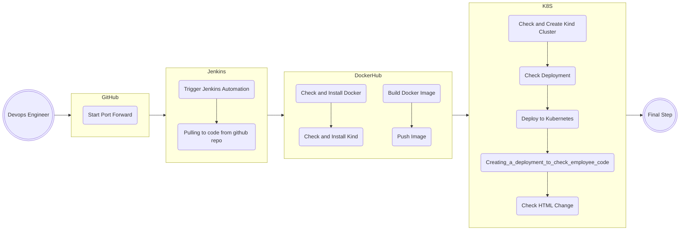

---

<h1> Hey Again &nbsp;&nbsp;&nbsp;Welcome To My "final_proj_git_jenkins" &nbsp;=)</h1>

 

## 💻 Languages and Tools:

   

---

&nbsp;
&nbsp;
&nbsp;
&nbsp;

# Instruction For Jenkins To Run New Job

## Table of Contents
1. [Step 1: Install Required Plugins](#step-1-install-required-plugins)
2. [Step 2: Create Docker Hub and Kubernetes Credentials](#step-2-create-docker-hub-and-kubernetes-credentials)
3. [Step 3: Update Jenkinsfile](#step-3-update-jenkinsfile)
4. [Step 4: Run the Pipeline](#step-4-run-the-pipeline)
5. [Pipeline Diagram](#pipeline-diagram)

## Step 1: Install Required Plugins

In Jenkins, go to:

**Dashboard > Manage Jenkins > Plugin Manager**

Install the following plugins:

- **GitHub Plugins**: GitHub, GitHub API Plugin, GitHub Branch Source, GitHub Pull Request Builder, Pipeline: GitHub Groovy Libraries.
- **Docker Plugins**: Docker, Docker API Plugin, Docker Commons Plugin, Docker Pipeline.
- **Kubernetes Plugins**: Kubernetes, 'Kubernetes :: Pipeline :: DevOps Steps', Kubernetes CLI Plugin, Kubernetes Client API Plugin, Kubernetes Continuous Deploy Plugin, Kubernetes Credentials, Kubernetes Credentials Provider.

## Step 2: Create Docker Hub and Kubernetes Credentials

In Jenkins, go to:

**Dashboard > Manage Jenkins > Credentials**

Click on "Global" and then "Add Credentials" as shown in the image below:

For Docker Hub, select the type for username and password credentials and fill in the required fields:

- **Username**: Your Docker Hub username
- **Password**: Your Docker Hub password
- **ID**: dockerhub
- **Description**: Docker Hub credentials

## Step 3: Update Jenkinsfile

In your Jenkinsfile, update the following lines:

- **IMAGE_NAME**: Your Docker Hub username and repository name
- **KUBECONFIG**: Path to the .kube directory on your master node

Optional: Update **CLUSTER_NAME** and **NAMESPACE** as needed, but ensure consistency throughout the code.

## Step 4: Run the Pipeline

To run the pipeline, go to the main Jenkins page and click "Build with Parameters" on the left side:

Select the desired branch to test before merging into the main branch:

The pipeline stages include:

1. **Connect to Branch**: Connects to your selected branch in the repository.
2. **Build Docker Image**: Builds the Docker image.
3. **Push Image**: Pushes the image to your Docker Hub repository using the previously created credentials.
4. **Check and Create Kind Cluster**: Checks if the cluster exists and creates one if necessary.
5. **Manual Approval**: Waits for your approval before proceeding. Follow these steps:
   - Add Kubernetes credentials by navigating to **Credentials > Global** and selecting the kubeconfig type:
   
     
   
   - Paste the content of your kubeconfig file from the master node's ~/.kube directory.
   - Create a namespace called jenkins in your cluster.
   - Approve the stage to continue.
6. **Check Deployment**: Checks if the deployment exists.
7. **Deploy to Kubernetes**: Deploys the application to Kubernetes.
8. **Check HTML Change**: Checks for changes in the HTML file and redeploys if necessary.
9. **Start Port Forward**: Starts port forwarding to access the website.

## Pipeline Diagram

The following diagram illustrates the stages and processes:

  
